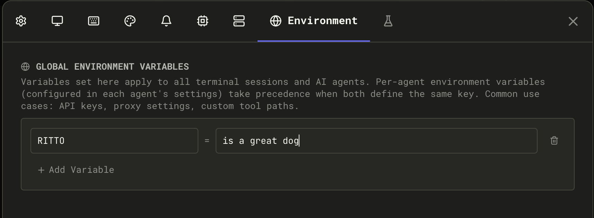

## Settings Overview

Open Settings with `Cmd+,` / `Ctrl+,` or via **Quick Actions** (`Cmd+K` / `Ctrl+K`) → "Open Settings".

Settings are organized into tabs:

| Tab                             | Contents                                                                                                                                                                                                                  |
| ------------------------------- | ------------------------------------------------------------------------------------------------------------------------------------------------------------------------------------------------------------------------- |
| **General**                     | About Me (conductor profile), shell configuration, input send behavior, default toggles (history, thinking), automatic tab naming, power management, updates, privacy, usage stats, storage location                      |
| **Display**                     | Font family and size, terminal width, log level and buffer, max output lines per response, document graph settings, context window warnings, [Accessibility](#accessibility) (Color Blind Mode, Bionify reading emphasis) |
| **Shortcuts**                   | Customize keyboard shortcuts (see [Keyboard Shortcuts](./keyboard-shortcuts))                                                                                                                                             |
| **Themes**                      | Dark, light, and vibe mode themes, custom theme builder with import/export                                                                                                                                                |
| **Notifications**               | OS notifications, custom command notifications, toast notification duration                                                                                                                                               |
| **AI Commands**                 | View and edit slash commands, [Spec-Kit](./speckit-commands), [OpenSpec](./openspec-commands), and [BMAD](./bmad-commands) prompts                                                                                        |
| **Maestro Prompts**             | Browse and edit the 23 core system prompts (wizard, Auto Run, group chat, context, etc.). Changes take effect immediately; reset to bundled defaults at any time                                                          |
| **SSH Hosts**                   | Configure remote hosts for [SSH agent execution](./ssh-remote-execution)                                                                                                                                                  |
| **Environment**                 | Global environment variables that cascade to all agents and terminal sessions                                                                                                                                             |
| **WakaTime** _(in General tab)_ | WakaTime integration toggle, API key, detailed file tracking                                                                                                                                                              |

## Maestro Prompts

Maestro ships with 23 core system prompts that control wizard conversations, Auto Run behavior, group chat moderation, context management, and more. You can customize any of them via the **Maestro Prompts** tab in Settings.

**To edit a prompt:**

1. Open **Settings** (`Cmd+,` / `Ctrl+,`) → **Maestro Prompts** tab
2. Select a prompt from the category list on the left
3. Edit the content in the editor
4. Click **Save** — changes take effect immediately (no restart needed)

**To reset a prompt:**

Click **Reset to Default** to restore the bundled version. This also takes effect immediately.

Customizations are stored separately from bundled prompts and survive app updates. You can also access the four most common prompts directly from **Quick Actions** (`Cmd+K` / `Ctrl+K`): Maestro System Prompt, Auto Run Default, Commit Command, and Group Chat Moderator.

For template variables, the `{{INCLUDE:name}}` and `{{REF:name}}` directives, creating reusable prompt fragments, and more, see the full [Prompt Customization](/prompt-customization) guide.

## Accessibility

The **Display** tab includes an **Accessibility** section that groups visual aids for color vision deficiencies and long-form reading. Open it via **Settings** (`Cmd+,` / `Ctrl+,`) → **Display** → scroll to **Accessibility**.

### Color Blind Mode

Toggle **Color Blind Mode** to swap Maestro's default red / green / yellow semantics for [Wong's colorblind-safe palette](https://www.nature.com/articles/nmeth.1618) (_Nature Methods_, 2011). The palette uses distinct hue **and** luminance steps so the signal survives protanopia, deuteranopia, tritanopia, and grayscale displays.

The toggle applies across the desktop app:

| Surface                                     | Default                     | Color Blind Mode           |
| ------------------------------------------- | --------------------------- | -------------------------- |
| Agent status dot — Ready                    | Theme green                 | Teal (`#009988`)           |
| Agent status dot — Thinking                 | Theme yellow                | Orange (`#EE7733`)         |
| Agent status dot — Error                    | Theme red                   | Vermillion (`#CC3311`)     |
| Agent status dot — Connecting               | Orange `#ff8800`            | Strong Blue (`#0077BB`)    |
| Diff viewer add / remove rows               | Green / red tints           | Teal / vermillion tints    |
| Diff viewer add / remove counts             | `text-green-500/-red-500`   | Teal / vermillion          |
| File explorer git status icons              | Theme success/error/warning | Teal / vermillion / orange |
| History activity graph (Auto bar)           | Theme yellow                | Orange                     |
| [Usage Dashboard](./usage-dashboard) charts | Theme accents               | Wong agent / line palette  |
| File extension badges                       | Theme accent                | Per-language Wong colors   |

Surfaces that aren't recolored: theme accent itself, file extension labels in plain text, terminal ANSI output (controlled by your terminal theme), the "Waiting for input" pulsing dot (uses theme accent), and the Cue activity bar (already uses a colorblind-safe cyan).

### Bionify Emphasis (Reading Mode)

Bionify-style emphasis bolds the leading fixation portion of each word to make long-form reading easier. It is opt-in and applies **only** to dedicated readers — File Preview and Auto Run document panes. Terminals, logs, chat input, and AI output stay unchanged so they remain easy to copy/paste.

- **Intensity** — Soft / Default / Strong. Controls how aggressive the fixation emphasis is.
- **Algorithm** — Advanced override of the fixation formula. Format: `[+|-] N1 N2 N3 N4 frac` where `-` skips common English words (`a`, `and`, `the`) and `+` highlights every word. The four integers set how many characters are emphasized for words of length 1–4, and `frac` is the fraction of characters emphasized for longer words (e.g. `0.4` = first 40%). Default: `- 0 1 1 2 0.4`. Click the **info** icon next to the toggle for the in-app reference.

## Conductor Profile

The **Conductor Profile** (Settings → General → **About Me**) is a short description of yourself that gets injected into every AI agent's system prompt. This helps agents understand your background, preferences, and communication style so they can tailor responses accordingly.

**To configure:**

1. Open **Settings** (`Cmd+,` / `Ctrl+,`) → **General** tab
2. Find the **About Me** text area at the top
3. Write a brief profile describing yourself

### What to Include

A good conductor profile is concise (a few sentences to a short paragraph) and covers:

- **Your role/background**: Developer, researcher, team lead, etc.
- **Technical context**: Languages you work with, tools you prefer, platforms you use
- **Communication preferences**: Direct vs. detailed, level of explanation needed
- **Work style**: Preferences for how agents should approach tasks

### Example Profile

```
Security researcher. macOS desktop. TypeScript and Python for tools.
Direct communication, no fluff. Action over process. Push back on bad ideas.
Generate markdown for Obsidian. CST timezone.
```

### How Agents Use It

When you start a session, Maestro includes your conductor profile in the system prompt sent to the AI agent. This means:

- Agents adapt their response style to match your preferences
- Technical context helps agents make appropriate assumptions
- Communication preferences reduce back-and-forth clarification

### Using in Custom Commands

You can reference your conductor profile in [slash commands](./slash-commands) using the `{{CONDUCTOR_PROFILE}}` template variable. This is useful for commands that need to remind agents of your preferences mid-conversation.

## Global Environment Variables

Configure environment variables once in Settings and they automatically apply to all AI agent processes and terminal sessions. This is perfect for managing API keys, proxy settings, custom tool paths, and other shared configuration.

### How to Configure

1. Open **Settings** (`Cmd+,` / `Ctrl+,`) → **Environment** tab
2. Add your variables in `KEY=VALUE` format using the **Add Variable** button
3. Variables apply immediately to new agent sessions and terminals



### Example Configuration

```env
ANTHROPIC_API_KEY=sk-proj-xxxxx
HTTP_PROXY=http://proxy.company.com:8080
HTTPS_PROXY=http://proxy.company.com:8080
DEBUG=maestro:*
MY_TOOL_PATH=~/tools/custom
```

### Important Features

- **Path expansion**: Use `~/` for home directory (e.g., `~/workspace` expands to `/Users/username/workspace`)
- **Quotes for special characters**: Variables with spaces or special characters should be quoted
- **Applied to both agents and terminals**: Global vars are available to all agent processes (Claude, OpenCode, etc.) and all terminal sessions
- **Agent-specific overrides**: You can override global variables with agent-specific settings (in agent configuration)
- **Persist across sync**: Global environment variables are included when you export or sync settings to another device

### Environment Variable Precedence

When an agent or terminal is spawned, variables are merged in this order (highest to lowest priority):

1. **Session-level overrides** - Temporary per-session customizations
2. **Global environment variables** (Settings) - Applied to all agents and terminals
3. **Agent-specific configuration** - Default settings for a particular agent
4. **System environment** - System and parent process variables

This means a session-level override will take precedence over the global setting, which takes precedence over agent defaults.

### Use Cases

- **API keys**: Set `ANTHROPIC_API_KEY` once → all Claude sessions can access it
- **Proxy settings**: Set `HTTP_PROXY` and `HTTPS_PROXY` → all network requests respect the proxy
- **Custom tool paths**: Set `MY_TOOLS=/opt/mytools` → agents can find custom utilities
- **Debugging**: Set `DEBUG=maestro:*` → enable consistent logging across all sessions
- **Language settings**: Set `LANG=en_US.UTF-8` → consistent text encoding

### Agent-Specific Overrides

To override a global variable for a specific agent:

1. In the agent configuration panel, scroll to **Environment Variables (optional)**
2. Add the variable with the override value
3. This session-specific value takes precedence over the global setting

## Checking for Updates

Maestro checks for updates automatically on startup (configurable in Settings → General → **Check for updates on startup**).

**To manually check for updates:**

- **Quick Actions:** `Cmd+K` / `Ctrl+K` → "Check for Updates"
- **Menu:** Click the hamburger menu (☰) → "Check for Updates"

When an update is available, you'll see:

- Current version and new version number
- Release notes summary
- **Download** button to get the latest release from GitHub
- Option to enable/disable automatic update checks

### Pre-release Channel (Beta Opt-in)

By default, Maestro only notifies you about stable releases. If you want to try new features before they're officially released, you can opt into the pre-release channel.

**To enable beta updates:**

1. Open **Settings** (`Cmd+,` / `Ctrl+,`) → **General** tab
2. Toggle **Include beta and release candidate updates** on

**What changes:**

- Update checks will include pre-release versions (e.g., `v0.11.1-rc`, `v0.12.0-beta`)
- You'll receive notifications for beta, release candidate (rc), and alpha releases
- The Update dialog will show all available pre-release versions

**Pre-release version types:**
| Suffix | Description |
|--------|-------------|
| `-alpha` | Early development, may be unstable |
| `-beta` | Feature-complete but still testing |
| `-rc` | Release candidate, nearly ready for stable |
| `-dev` | Development builds |
| `-canary` | Cutting-edge nightly builds |

**Reverting to stable:** Toggle the setting off and download the latest stable release from GitHub. Pre-releases won't auto-downgrade to stable versions.

<Warning>
Pre-release versions may contain experimental features and bugs. Use at your own risk. If you encounter issues, you can always download the latest stable release from [GitHub Releases](https://github.com/RunMaestro/Maestro/releases).
</Warning>

## Notifications & Sound

Configure audio and visual notifications in **Settings** (`Cmd+,` / `Ctrl+,`) → **Notifications** tab.

### OS Notifications

Enable desktop notifications to be alerted when:

- An AI task completes
- A long-running command finishes
- The agent requires attention

**To enable:**

1. Toggle **Enable OS Notifications** on
2. Click **Test Notification** to verify it works

### Custom Notification

Execute a custom command when AI tasks complete. Use any notification method that fits your workflow.

**To configure:**

1. Toggle **Enable Custom Notification** on
2. Set the **Command Chain** — the command(s) that accept text via stdin:
   - **macOS:** `say` (text-to-speech), `afplay /path/to/sound.wav` (audio file)
   - **Linux:** `notify-send "Maestro"`, `espeak`, `paplay /path/to/sound.wav`
   - **Windows:** PowerShell scripts or third-party tools
   - **Custom:** Any command or script that accepts stdin
3. Click **Test** to verify your command works
4. Click **Stop** to interrupt a running test

**Command chaining:** Chain multiple commands together using pipes to mix and match tools. Examples:

- `say` — speak aloud using macOS text-to-speech
- `tee ~/log.txt | say` — log to a file AND speak aloud
- `notify-send "Maestro" && espeak` — show desktop notification and speak (Linux)
- `afplay ~/sounds/done.wav` — play a sound file (macOS)

### Toast Notifications

In-app toast notifications appear in the corner when events occur. Configure how long they stay visible:

| Duration                 | Behavior                                  |
| ------------------------ | ----------------------------------------- |
| **Off**                  | Toasts are disabled entirely              |
| **5s / 10s / 20s / 30s** | Toast disappears after the specified time |
| **Never**                | Toast stays until manually dismissed      |

### When Notifications Trigger

Notifications are sent when:

- An AI task completes (OS notification + optional custom notification)
- A long-running command finishes (OS notification)

## Sleep Prevention

Maestro can prevent your computer from sleeping while AI agents are actively working, ensuring long-running tasks complete without interruption.

**To enable:**

1. Open **Settings** (`Cmd+,` / `Ctrl+,`) → **General** tab
2. Scroll to the **Power** section
3. Toggle **Prevent sleep while working** on

### When Sleep Prevention Activates

Sleep prevention automatically activates when:

- Any session is **busy** (agent processing a request)
- **Auto Run** is active (processing tasks)
- **Group Chat** is in progress (moderator or agents responding)

When all activity stops, sleep prevention deactivates automatically.

### Platform Support

| Platform    | Support Level                 | Notes                                                                                                       |
| ----------- | ----------------------------- | ----------------------------------------------------------------------------------------------------------- |
| **macOS**   | Full support                  | Equivalent to running `caffeinate`. Check Activity Monitor → View → Columns → "Preventing Sleep" to verify. |
| **Windows** | Full support                  | Uses `SetThreadExecutionState`. Verify with `powercfg /requests` in admin CMD.                              |
| **Linux**   | Varies by desktop environment | Works on GNOME, KDE, XFCE via D-Bus. See notes below.                                                       |

### Linux Desktop Environment Notes

Sleep prevention on Linux uses standard freedesktop.org interfaces:

- **GNOME, KDE, XFCE**: Full support via D-Bus screen saver inhibition
- **Minimal window managers** (i3, sway, dwm, bspwm): May not work. These environments typically don't run a screen saver daemon.

**If sleep prevention doesn't work on Linux:**

1. Ensure `xdg-screensaver` is installed
2. Verify a D-Bus screen saver service is running
3. Some systems may need `gnome-screensaver`, `xscreensaver`, or equivalent

<Info>
On unsupported Linux configurations, the feature silently does nothing — your system will sleep normally according to its power settings.
</Info>

## WakaTime Integration

Maestro integrates with [WakaTime](https://wakatime.com) to track coding activity across your AI sessions. The WakaTime CLI is auto-installed when you enable the integration.

**To enable:**

1. Open **Settings** (`Cmd+,` / `Ctrl+,`) → **General** tab
2. Toggle **Enable WakaTime tracking** on
3. Enter your API key (get it from [wakatime.com/settings/api-key](https://wakatime.com/settings/api-key))

### What Gets Tracked

By default, Maestro sends **app-level heartbeats** — WakaTime sees time spent in Maestro as a single project entry with language detected from your project's manifest files (e.g., `tsconfig.json` → TypeScript).

### Detailed File Tracking

Enable **Detailed file tracking** to send per-file heartbeats for write operations. When an agent writes or edits a file, Maestro sends that file path to WakaTime with:

- The file's language (detected from extension)
- A write flag indicating the file was modified
- Project name and branch

File paths (not file content) are sent to WakaTime's servers. This setting defaults to off and requires two explicit opt-ins (WakaTime enabled + detailed tracking enabled).

### Supported Tools

File heartbeats are generated for write operations across all supported agents:

| Agent       | Tracked Tools                                           |
| ----------- | ------------------------------------------------------- |
| Claude Code | Write, Edit, NotebookEdit                               |
| Codex       | write_to_file, str_replace_based_edit_tool, create_file |
| OpenCode    | write, patch                                            |

Read operations and shell commands are excluded to avoid inflating tracked time.

### Activity Categories

Maestro assigns WakaTime categories based on how the session was initiated:

- **Interactive sessions** (user-driven) are tracked as `building`
- **Auto Run / batch sessions** are tracked as `ai coding`

This lets you distinguish time you spent actively directing agents from time the AI worked autonomously on your WakaTime dashboard.

## Storage Location

Settings are stored in:

- **macOS**: `~/Library/Application Support/maestro/`
- **Windows**: `%APPDATA%/maestro/`
- **Linux**: `~/.config/maestro/`

## Cross-Device Sync (Beta)

Maestro can sync settings, sessions, and groups across multiple devices by storing them in a cloud-synced folder like iCloud Drive, Dropbox, or OneDrive.

**Setup:**

1. Open **Settings** (`Cmd+,` / `Ctrl+,`) → **General** tab
2. Scroll to **Storage Location**
3. Click **Choose Folder...** and select a synced folder:
   - **iCloud Drive**: `~/Library/Mobile Documents/com~apple~CloudDocs/Maestro`
   - **Dropbox**: `~/Dropbox/Maestro`
   - **OneDrive**: `~/OneDrive/Maestro`
4. Maestro will migrate your existing settings to the new location
5. Restart Maestro for changes to take effect
6. Repeat on your other devices, selecting the same synced folder

**What syncs:**

- Settings and preferences
- Session configurations
- Groups and organization
- Agent configurations
- Session origins and metadata

**What stays local:**

- Window size and position (device-specific)
- The bootstrap file that points to your sync location

**Important limitations:**

- **Single-device usage**: Only run Maestro on one device at a time. Running simultaneously on multiple devices can cause sync conflicts where the last write wins.
- **No conflict resolution**: If settings are modified on two devices before syncing completes, one set of changes will be lost.
- **Restart required**: Changes to storage location require an app restart to take effect.

To reset to the default location, click **Use Default** in the Storage Location settings.
