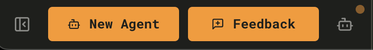
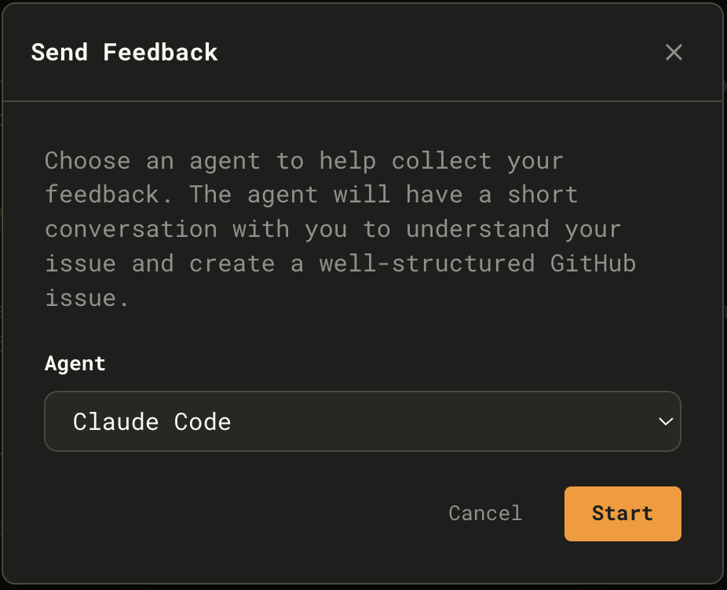
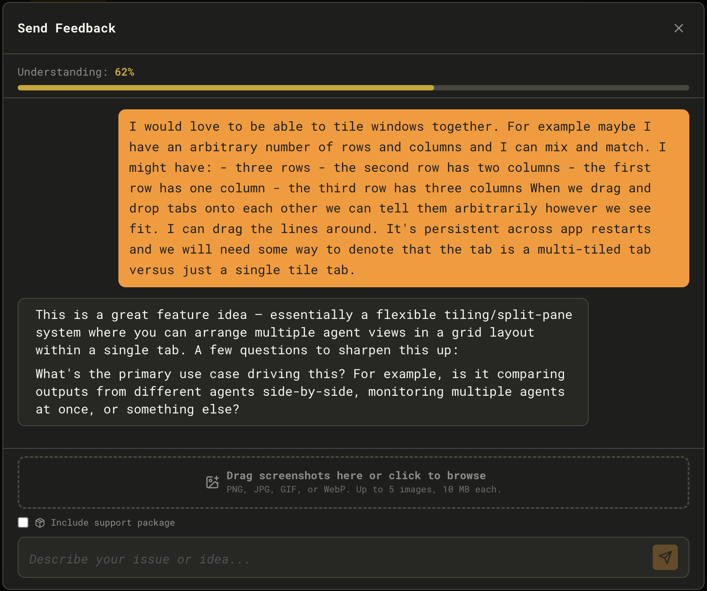
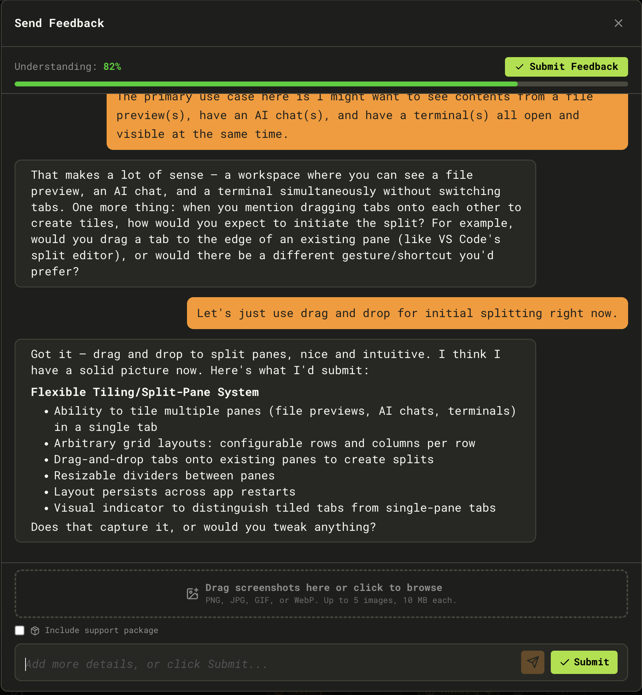

Maestro includes a built-in feedback system that uses AI to help you craft well-structured GitHub issues. Instead of filling out a form, you have a short conversation - the AI asks clarifying questions, checks for duplicates, and submits a polished issue on your behalf.

## Prerequisites

- [GitHub CLI](https://cli.github.com/) (`gh`) must be installed
- You must be authenticated (`gh auth login`)

## Sending Feedback

### 1. Open the Feedback Modal

Click the **Feedback** button in the bottom-left corner of the sidebar, next to **New Agent**.

You can also open it via **Quick Actions** (`Cmd+K` / `Ctrl+K`) → "Send Feedback".

### 2. Choose an AI Agent

Select which installed AI provider will conduct the feedback conversation. Maestro auto-detects available agents (Claude Code, Codex, OpenCode) and pre-selects the first one found.

Click **Start** to begin.

### 3. Describe Your Issue

Tell the AI what's on your mind - a bug you hit, a feature you want, or general feedback. The AI classifies your input and asks targeted follow-up questions:

- **Bug reports** - What happened? What was expected? Steps to reproduce?
- **Feature requests** - Use case? Desired outcome? Why it matters?

A confidence bar at the top tracks how well the AI understands your issue. As you answer questions, it fills toward 100%.

**Optional attachments:**

- Drag and drop up to 5 screenshots (PNG, JPG, GIF, or WebP - 10 MB each)
- Check **Include support package** to attach debug information

### 4. Review and Submit

Once understanding reaches **80%**, a green **Submit Feedback** button appears. The AI presents a structured summary of what it will submit. Review the summary, tweak anything by continuing the conversation, then click **Submit**.

### Duplicate Detection

As you describe your issue, Maestro searches existing GitHub issues in the background. If similar issues are found, an inline card appears listing them. You can:

- **Subscribe to an existing issue** - Your context is added as a comment with a +1 reaction
- **Create a new issue anyway** - Bypasses the match and files a fresh issue

This prevents duplicate reports while still capturing your unique context.

### After Submission

Once submitted, you'll see a confirmation with:

- A direct link to the new GitHub issue
- A copy-to-clipboard button for the issue URL
- An option to open the issue in your browser
