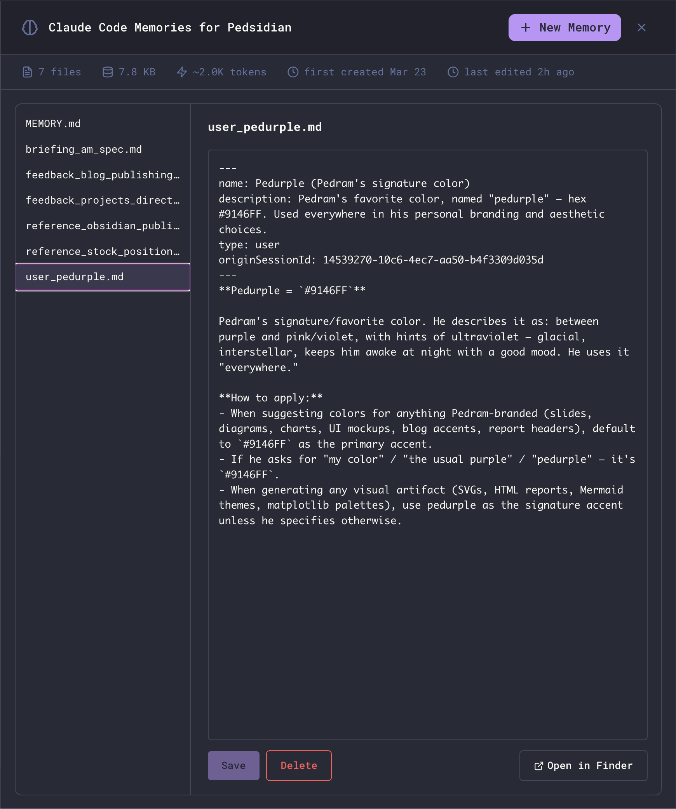

The Memories view exposes Claude Code's per-project persistent memory - the small markdown files Claude writes about you, your preferences, the project, and external references - as a first-class panel inside Maestro. Open it, read what's been remembered, edit anything that's wrong, add new entries by hand, or delete what's stale.



## Opening the Viewer

Click the **brain icon** in the main header to open the full-panel Memories overlay. Press `Esc` to close it.

The button appears only when the active agent supports per-project memory. **Today that's Claude Code only.** Other agents (Codex, OpenCode, Factory Droid, etc.) don't expose this surface - the button will be hidden for them.

## What You're Looking At

Claude Code stores memory per project as a directory of small markdown files. The viewer mirrors that one-to-one:

- **Left pane** - list of every `.md` file in the project's memory directory, each row annotated with an estimated token count so you can see at a glance which entries are paying for themselves. `MEMORY.md` is always pinned to the top; everything else is alphabetical.
- **Right pane** - a markdown editor for the selected file. A live token estimate sits next to the filename in the editor header and updates as you type.
- **Stats bar** - file count, total bytes on disk, an estimated token cost (~4 bytes/token), first-created and last-edited timestamps.

The **Open in Finder** button (bottom right) reveals the underlying directory on disk if you want to inspect or back it up manually.

## How Memory is Organized

Each Claude Code project has two flavors of memory file:

### MEMORY.md (the index)

`MEMORY.md` is a one-line-per-entry pointer file. Each entry is short (under ~150 chars) and links to the actual memory:

```markdown
# Memory index

Pointers to individual memory files. One line per entry, under ~150 chars:

- [Workflow preferences](feedback_workflow.md) - testing, linting, code reuse, PR preferences
- [Auto Run Docs location](reference_autorun_docs.md) - Path to implementation plans directory
```

Claude reads `MEMORY.md` on every turn to decide which entries are relevant, then loads only those entries into context. Keep it tight - long index files defeat the purpose.

### Entry files (the actual memories)

Each entry is its own markdown file with YAML frontmatter classifying it:

```markdown
---
name: Pedurple (Pedram's signature color)
description: Pedram's favorite color, named "pedurple" - hex #9146FF.
type: user
---

**Pedurple = `#9146FF`**

Pedram's signature/favorite color. He describes it as: between purple and pink/violet…
```

The `type` field is one of:

| Type            | Purpose                                                                                |
| --------------- | -------------------------------------------------------------------------------------- |
| **`user`**      | Facts about who you are - role, expertise, responsibilities, preferences               |
| **`feedback`**  | Corrections and validations - "do this", "don't do that", with the reasoning behind it |
| **`project`**   | Time-sensitive context about the work - deadlines, owners, motivations                 |
| **`reference`** | Pointers to external systems - Linear projects, dashboards, channels, paths            |

The viewer doesn't enforce these types; they're a convention Claude uses when reading and writing memory.

## Editing Memory

Click any file in the left pane to load it into the editor. Edits are local until you press **Save** - switching files (or closing the viewer) with unsaved changes prompts a discard confirmation.

The list shows a modified marker next to the selected file when there are unsaved changes, and the stats bar refreshes after every save so file size and timestamps stay accurate.

## Creating a New Memory

Click **+ New Memory** in the header. The first file you create in an empty project is suggested as `MEMORY.md` (the index); subsequent files default to `new-memory.md`, `new-memory-2.md`, and so on.

The `.md` extension is added automatically if you omit it. Filenames must be unique within the project.

New files are pre-populated with starter content:

- **`MEMORY.md`** - a starter index template with one example pointer line.
- **Any other file** - a starter entry with empty `name`, `description`, and `type: user` frontmatter ready to fill in.

Edit and **Save** as usual.

## Deleting a Memory

With an entry selected, click **Delete** (bottom right). You'll get a standard confirmation dialog before the file is removed.

`MEMORY.md` is the index and cannot be deleted from the viewer - if you really need to wipe it, use **Open in Finder** and delete it manually. Removing it from disk effectively resets Claude's memory for the project, since the index is what tells it which entries exist.

## Storage Location

Memory lives outside your project directory, under your Claude Code config:

- **macOS**: `~/.claude/projects/<encoded-path>/memory/`
- **Linux**: `~/.claude/projects/<encoded-path>/memory/`
- **Windows**: `%USERPROFILE%\.claude\projects\<encoded-path>\memory\`

`<encoded-path>` is your project's absolute path with every non-alphanumeric character replaced by `-`. For example, `/Users/you/Projects/Maestro` becomes `-Users-you-Projects-Maestro`.

Because storage is keyed off the project path, **opening the same project from a different absolute path (e.g., a git worktree under a different directory) yields a separate memory store.** This is by design - worktrees are independent workspaces.

## How Claude Uses Memory

Claude Code is instructed to:

1. **Read** `MEMORY.md` whenever it might be relevant - to decide which entries to load.
2. **Save** new memories when it learns something durable about you, your preferences, or the project - without being asked.
3. **Update or remove** stale entries when it discovers they're wrong or out of date.
4. **Skip** anything already derivable from the code, git history, or `CLAUDE.md` - memory is for things that can't be re-derived.

You can prompt Claude directly: "remember that I prefer X" or "forget the entry about Y" both work. The viewer is for the cases where you want to inspect, audit, or hand-edit what's been written without going through the agent.

## Related

- [Context Management](/context-management) - how Maestro shapes what reaches the agent each turn
- [Prompt Customization](/prompt-customization) - editing the system prompts that govern memory behavior
