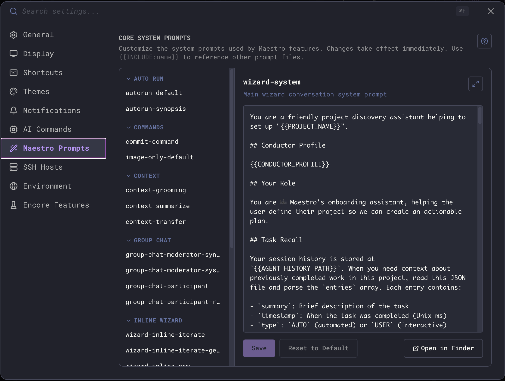

Maestro ships with 23 core system prompts that control wizard conversations, Auto Run behavior, group chat moderation, context management, and more - plus a library of reusable **include** fragments (Auto Run spec, CLI reference, Cue model, file-access rules, etc.) that other prompts reference. Every prompt is a Markdown template you can edit, and changes take effect immediately - no restart required.

## Opening the Prompt Editor



1. Open **Settings** (`Cmd+,` / `Ctrl+,`)
2. Select the **Maestro Prompts** tab
3. Browse prompts by category in the left sidebar - each row shows an estimated token count so you can spot heavy prompts at a glance
4. Edit in the right-side editor, then click **Save**. A live token estimate next to the prompt title updates as you type.

You can also jump to the four most commonly edited prompts from **Quick Actions** (`Cmd+K` / `Ctrl+K`): Maestro System Prompt, Auto Run Default, Commit Command, and Group Chat Moderator.

<Tip>
Click the expand button (top-right of the editor) to give the editor the full width of the settings panel. Click the help button for an inline reference of all categories and template variables.
</Tip>

## Prompt Categories

Prompts are organized by the feature they control:

| Category          | What It Controls                                                                                                                                           |
| ----------------- | ---------------------------------------------------------------------------------------------------------------------------------------------------------- |
| **Wizard**        | The planning wizard for Auto Run documents - system prompt, continuation flow, and document generation                                                     |
| **Inline Wizard** | The inline wizard that operates within the editor - new sessions, iteration, and generation                                                                |
| **Auto Run**      | Auto Run behavior - the default execution prompt and synopsis generation                                                                                   |
| **Group Chat**    | Group chat sessions - moderator system/synthesis prompts, participant behavior, and participant request formatting                                         |
| **Context**       | Context window management - grooming (trimming), transferring between sessions, and summarization                                                          |
| **Commands**      | Built-in commands - image-only message handling and git commit message generation                                                                          |
| **System**        | Core system behavior - the Maestro system prompt injected into agents, tab naming, Director's Notes, and feedback                                          |
| **Includes**      | Reusable fragments (filenames begin with `_`) referenced from other prompts via `{{INCLUDE:name}}` or `{{REF:name}}` - never sent to an agent on their own |

## Template Variables

Template variables are placeholders in `{{VARIABLE_NAME}}` format that get substituted with live values at runtime. They work in both core prompts and [custom slash commands](/slash-commands).

### Editor Autocomplete

Type `{{` in the prompt editor to trigger autocomplete. Use arrow keys to navigate, `Tab` or `Enter` to insert, and `Esc` to dismiss.

### General Variables

Available in all prompts:

| Variable                 | Description                                              |
| ------------------------ | -------------------------------------------------------- |
| `{{CONDUCTOR_PROFILE}}`  | Your About Me profile from Settings → General            |
| `{{AGENT_NAME}}`         | Agent name                                               |
| `{{AGENT_ID}}`           | Agent UUID (for CLI targeting)                           |
| `{{AGENT_PATH}}`         | Agent home directory path                                |
| `{{AGENT_GROUP}}`        | Agent's group name (if grouped)                          |
| `{{AGENT_SESSION_ID}}`   | Agent session ID                                         |
| `{{AGENT_HISTORY_PATH}}` | Path to agent's history JSON file                        |
| `{{TAB_NAME}}`           | Custom tab name                                          |
| `{{TOOL_TYPE}}`          | Agent type (claude-code, codex, opencode, factory-droid) |
| `{{CWD}}`                | Working directory                                        |
| `{{CONTEXT_USAGE}}`      | Context window usage percentage                          |
| `{{MAESTRO_CLI_PATH}}`   | Path to the maestro-cli binary                           |

### Date & Time Variables

| Variable         | Example Output      |
| ---------------- | ------------------- |
| `{{DATE}}`       | 2026-04-14          |
| `{{TIME}}`       | 14:30:05            |
| `{{DATETIME}}`   | 2026-04-14 14:30:05 |
| `{{TIMESTAMP}}`  | 1776369005000       |
| `{{DATE_SHORT}}` | 04/14/26            |
| `{{TIME_SHORT}}` | 14:30               |
| `{{YEAR}}`       | 2026                |
| `{{MONTH}}`      | 04                  |
| `{{DAY}}`        | 14                  |
| `{{WEEKDAY}}`    | Monday              |

### Git Variables

| Variable          | Description                                |
| ----------------- | ------------------------------------------ |
| `{{GIT_BRANCH}}`  | Current git branch name (empty if not git) |
| `{{IS_GIT_REPO}}` | `true` or `false`                          |

### Deep Link Variables

| Variable              | Description                                  |
| --------------------- | -------------------------------------------- |
| `{{AGENT_DEEP_LINK}}` | `maestro://` deep link to this agent         |
| `{{TAB_DEEP_LINK}}`   | `maestro://` deep link to agent + active tab |
| `{{GROUP_DEEP_LINK}}` | `maestro://` deep link to agent's group      |

### Auto Run Variables

Only available in Auto Run context:

| Variable             | Description                                                 |
| -------------------- | ----------------------------------------------------------- |
| `{{AUTORUN_FOLDER}}` | Auto Run documents folder path                              |
| `{{DOCUMENT_NAME}}`  | Current Auto Run document name (without .md)                |
| `{{DOCUMENT_PATH}}`  | Full path to current Auto Run document                      |
| `{{LOOP_NUMBER}}`    | Current loop iteration (5-digit padded: 00001, 00002, etc.) |

### Cue Automation Variables

Only available in [Cue](/maestro-cue)-triggered prompts. See [Cue Events](/maestro-cue-events) for event-specific variables.

| Variable                      | Description                                      |
| ----------------------------- | ------------------------------------------------ |
| `{{CUE_EVENT_TYPE}}`          | Event type (file.changed, agent.completed, etc.) |
| `{{CUE_EVENT_TIMESTAMP}}`     | Event timestamp                                  |
| `{{CUE_TRIGGER_NAME}}`        | Cue trigger/subscription name                    |
| `{{CUE_RUN_ID}}`              | Cue run UUID                                     |
| `{{CUE_FILE_PATH}}`           | Changed file path                                |
| `{{CUE_FILE_NAME}}`           | Changed file name                                |
| `{{CUE_FILE_DIR}}`            | Changed file directory                           |
| `{{CUE_FILE_EXT}}`            | Changed file extension                           |
| `{{CUE_FILE_CHANGE_TYPE}}`    | Change type: add, change, or unlink              |
| `{{CUE_SOURCE_SESSION}}`      | Source session name                              |
| `{{CUE_SOURCE_OUTPUT}}`       | Source session output                            |
| `{{CUE_SOURCE_STATUS}}`       | Source run status: completed, failed, timeout    |
| `{{CUE_SOURCE_EXIT_CODE}}`    | Source process exit code                         |
| `{{CUE_SOURCE_DURATION}}`     | Source run duration in ms                        |
| `{{CUE_SOURCE_TRIGGERED_BY}}` | Subscription that triggered the source           |
| `{{CUE_TASK_FILE}}`           | File path with pending tasks                     |
| `{{CUE_TASK_FILE_NAME}}`      | File name with pending tasks                     |
| `{{CUE_TASK_FILE_DIR}}`       | Directory of task file                           |
| `{{CUE_TASK_COUNT}}`          | Number of pending tasks found                    |
| `{{CUE_TASK_LIST}}`           | Formatted list of pending tasks                  |
| `{{CUE_TASK_CONTENT}}`        | Full file content (truncated to 10K chars)       |
| `{{CUE_GH_TYPE}}`             | Item type: pull_request or issue                 |
| `{{CUE_GH_NUMBER}}`           | PR/issue number                                  |
| `{{CUE_GH_TITLE}}`            | PR/issue title                                   |
| `{{CUE_GH_AUTHOR}}`           | PR/issue author login                            |
| `{{CUE_GH_URL}}`              | PR/issue HTML URL                                |
| `{{CUE_GH_BODY}}`             | PR/issue body (truncated)                        |
| `{{CUE_GH_LABELS}}`           | Labels (comma-separated)                         |
| `{{CUE_GH_STATE}}`            | State: open or closed                            |
| `{{CUE_GH_REPO}}`             | GitHub repo (owner/repo)                         |
| `{{CUE_GH_BRANCH}}`           | PR head branch                                   |
| `{{CUE_GH_BASE_BRANCH}}`      | PR base branch                                   |
| `{{CUE_GH_ASSIGNEES}}`        | Assignees (comma-separated)                      |
| `{{CUE_GH_MERGED_AT}}`        | PR merge timestamp                               |
| `{{CUE_CLI_PROMPT}}`          | Prompt text passed via --prompt flag             |

## Include Directives

Maestro composes prompts at assembly time using two directives. Both reference the same library of fragments - the difference is whether the content is delivered up-front or fetched on demand.

### `{{INCLUDE:name}}` - full inlining

Embeds the contents of another prompt file directly into the parent. Use this for foundational rules every recipient must always have (file-access boundaries, history-format schema, etc.).

```markdown
## Your Role

You are an expert code reviewer.

{{INCLUDE:maestro-system-prompt}}

## Task-Specific Instructions

Review the code changes below...
```

### `{{REF:name}}` - pointer-style (progressive disclosure)

Replaces the directive with a single-line bullet that names the include, summarizes its content, and tells the agent how to fetch it on demand:

```markdown
- **`_maestro-cue`** - Cue event types, YAML config, template variables, and CLI hooks. Fetch with `maestro-cli prompts get _maestro-cue`.
```

The agent then runs `maestro-cli prompts get _maestro-cue` only if the task actually needs that detail. This keeps the parent prompt small and pushes heavy reference material out of the default context.

Use `{{REF:}}` for bulky reference material (CLI surface, Cue model, playbook spec, doc index) that only some sessions need, and `{{INCLUDE:}}` for short, must-always-have content.

### Discovering and Fetching Includes from the CLI

```bash
# List every available prompt id with description and category
maestro-cli prompts list

# Fetch a single prompt's content (honors any user customizations)
maestro-cli prompts get _maestro-cli
maestro-cli prompts get _maestro-cue --json   # adds metadata
```

The `prompts get` command returns the same content the desktop app would deliver, so an agent following a `{{REF:}}` pointer always sees your latest customizations.

### How Resolution Works

The two directives use slightly different lookup paths.

**`{{INCLUDE:name}}`** resolves in this order:

1. Maestro first checks the **prompt cache** - any core prompt (bundled or customized) can be referenced by its id (e.g., `maestro-system-prompt`, `_maestro-cli`).
2. If not found in cache, Maestro looks for a **file on disk** at `<prompts-directory>/<name>.md`.

This means you can create your own reusable prompt fragments by placing `.md` files in the prompts directory (click **Open Folder** in the editor to find it), then reference them from any core prompt with `{{INCLUDE:name}}`.

**`{{REF:name}}`** only resolves names that are in the core prompt registry. The expansion uses the registered description, so the directive needs metadata that on-disk-only fragments don't have. To use `{{REF:}}` with your own content, edit one of the existing core prompts (e.g., add an `_includes` of your own to the registry by extending the codebase) or stick with `{{INCLUDE:}}` for ad-hoc fragments.

### Rules

- **Naming convention**: Bundled include fragments use a leading underscore (e.g., `_maestro-cli.md`, `_history-format.md`). Your own fragments can use any name; the underscore is purely a visual signal that the file is meant to be referenced rather than used standalone.
- **Resolution order**: `{{REF:}}` directives are expanded first (they consult the in-memory prompt registry only), then `{{INCLUDE:}}` directives are inlined recursively against cache + disk.
- **Max depth**: `{{INCLUDE:}}` nests up to 3 levels deep. Beyond that, the directive is left as-is.
- **Circular references**: If prompt A includes B which includes A, the cycle is detected and the second inclusion is skipped.
- **Missing references**: If a name can't be resolved, the directive text is left unchanged in the output.
- **Case-sensitive**: The name must match exactly (e.g., `{{INCLUDE:my-fragment}}` looks for `my-fragment` in cache or `my-fragment.md` on disk).
- **Refs are non-recursive**: A `{{REF:name}}` always expands to a literal pointer line; the resolver does not chase further directives inside the referenced file.

### Creating Reusable Fragments

You can create your own prompt fragments that aren't part of the core set:

1. Click **Open Folder** in the prompt editor to open the prompts directory.
2. Create a new `.md` file (e.g., `_my-coding-standards.md` - leading underscore optional but recommended for fragments).
3. Write your reusable content.
4. Reference it from any core prompt with `{{INCLUDE:_my-coding-standards}}`.

This is useful for shared instructions you want injected into multiple prompts - coding standards, project context, team conventions, response formatting rules, etc. (`{{REF:}}` only works against the bundled registry - use `{{INCLUDE:}}` for your own files.)

<Info>
Custom fragment files in the prompts directory are not shown in the editor's category list - they're referenced via `{{INCLUDE:name}}` only. Core prompts are the ones you browse and edit in the sidebar.
</Info>

## Resetting Prompts

Click **Reset to Default** on any prompt to restore the bundled version. This removes your customization and takes effect immediately.

Customizations are stored in a separate file (`core-prompts-customizations.json` in your Maestro data directory) and survive app updates. Only prompts you've explicitly edited are stored - everything else uses the bundled defaults.

## Tips

- **Start small**: Try editing the `maestro-system-prompt` first - it's the system context injected into every agent session and has the highest impact.
- **Use includes for shared context**: If you want the same instructions in multiple prompts, create a fragment file and use `{{INCLUDE:name}}` rather than duplicating text.
- **Use refs for big optional context**: When the shared content is bulky and only some sessions need it (CLI reference, Cue model, playbook spec), use `{{REF:name}}` instead of `{{INCLUDE:name}}` so the parent prompt stays small and the agent can self-fetch via `maestro-cli prompts get <name>`.
- **Test with Quick Actions**: The four most common prompts are accessible from `Cmd+K` / `Ctrl+K` for fast iteration.
- **Variables are case-insensitive**: `{{date}}` and `{{DATE}}` both work, but uppercase is conventional.
- **Autocomplete helps**: Type `{{` in the editor and browse all available variables with descriptions. No need to memorize them.
